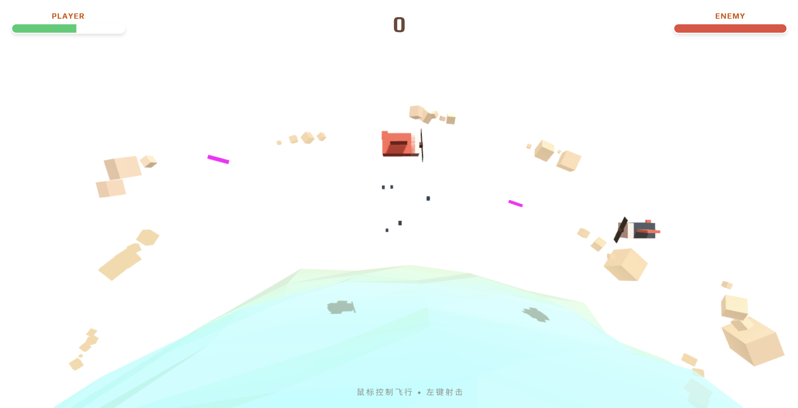

# SkyAce: 3D Low Poly Dogfight

一款基于Web的3D低多边形空战射击游戏，使用Three.js构建，提供了流畅的空中战斗体验。

#阿里云ESA Pages #阿里云云工开物

本项目是**阿里云 ESA (Edge Security Acceleration) 边缘计算创新大赛**的创意参赛作品。
借助 **阿里云 ESA** 强大的边缘计算能力，我们将这个富交互的静态网站分发到全球节点，确保用户在世界任何角落都能体验到闪电般的加载速度。

## 功能特性

- **3D低多边形美术风格**：采用独特的低多边形视觉设计，营造出简约而富有艺术感的游戏画面
- **实时战斗系统**：玩家可与敌方战机进行实时空战，体验紧张刺激的空中对决
- **动态环境**：包含动态波浪效果的海洋、漂浮的云朵和逼真的光影效果
- **粒子爆炸效果**：精美的爆炸粒子效果，增强战斗打击感
- **智能敌人AI**：敌机具备自主移动和攻击能力，采用8字形盘旋战术
- **实时生命值显示**：玩家和敌人的血量条实时更新
- **得分系统**：击中敌人获得分数，挑战更高分数记录
- **屏幕震动反馈**：被击中时的屏幕震动效果，提升沉浸感
- **响应式UI界面**：现代化的抬头显示器(HUD)，清晰显示各项游戏信息

## 快速开始

1. 确保你的浏览器支持WebGL（如Chrome、Firefox、Edge等现代浏览器）
2. 双击打开 `1172.html` 文件即可开始游戏
3. 使用鼠标控制飞机飞行方向
4. 点击鼠标左键进行射击

## 游戏规则

- **生命值**：玩家和敌人都有100点生命值，被击中会减少生命值
- **射击机制**：
  - 玩家使用鼠标左键发射子弹攻击敌人
  - 敌人会自动追踪玩家并发射子弹
- **胜利条件**：将敌人的生命值降至0
- **失败条件**：玩家生命值降至0
- **难度递增**：每次击败敌人后，其重生时生命值会增加，提高挑战性
- **计分系统**：击中敌人获得50分，努力获得更高的总分
- **游戏重置**：游戏结束后点击"Re-Engage"按钮重新开始

## 技术栈

- **Three.js**：核心3D图形引擎，用于渲染3D场景、模型和动画
- **WebGL**：底层图形API，提供硬件加速的3D渲染
- **HTML5 Canvas**：用于渲染游戏画面
- **CSS3**：现代化UI设计，包括渐变背景、Flexbox布局和动画效果
- **JavaScript**：游戏逻辑实现，包括对象管理、碰撞检测、动画循环等
- **Web Audio API**（隐含）：用于音效处理（如果有的话）
- **字体API**：使用Google Fonts的Play字体，增强游戏界面的复古风格
- **响应式设计**：适配不同屏幕尺寸的窗口大小调整功能

## 声明
“本项目由阿里云ESA提供加速、计算和保护”

